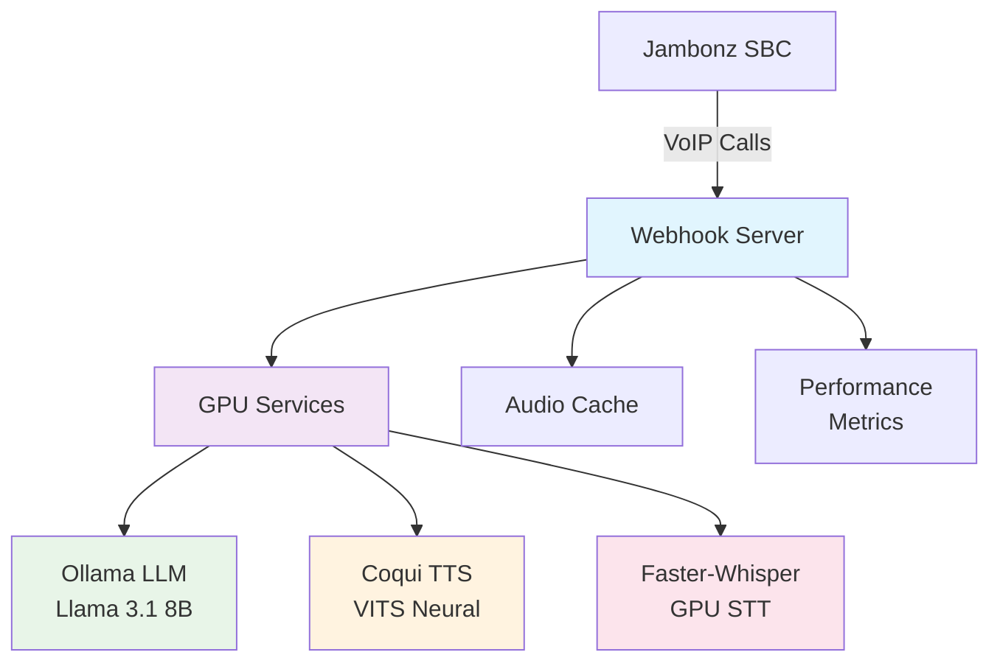

# OpenSourceVoice - 100% Local GPU Voice AI Stack

**Complete Docker Compose solution for AI-powered voice applications with Jambonz integration**

A containerized voice AI stack that runs entirely on local GPU hardware with no external API dependencies. Provides speech-to-text, text-to-speech, and conversational AI capabilities for telephony applications.

## 🌟 Features

- **🎤 GPU Speech Recognition** - Faster-Whisper (3x+ speedup over standard Whisper)
- **🧠 Local LLM Processing** - Ollama with Llama 3.1, Mistral, Phi-3, and more  
- **🎵 Production-Quality TTS** - Coqui VITS neural synthesis (67x real-time)
- **📊 Performance Monitoring** - Real-time metrics and GPU vs cloud comparisons
- **🔄 Automatic Cleanup** - Intelligent audio file management
- **🚀 Zero External APIs** - 100% self-hosted, no data leaves your infrastructure
- **🐳 Container-Ready** - Complete Docker Compose deployment
- **📞 Jambonz Compatible** - Drop-in webhook server for VoIP integration

## 🏗️ Architecture



## ⚡ Performance Results

| Component | Processing Time | Quality | Hardware |
|-----------|----------------|---------|----------|
| **LLM (Llama 3.1 8B)** | 4.9 seconds | Human-like responses | RTX 3090 Ti |
| **TTS (VITS)** | 1.7 seconds | 22kHz professional | RTX 3090 Ti |
| **Total Response** | **6.6 seconds** | Production-ready | RTX 3090 Ti |

*67x faster than real-time for TTS generation*

## 🚀 Quick Start

### Prerequisites

- **Hardware**: NVIDIA GPU with 8GB+ VRAM
- **Software**: Docker + NVIDIA Container Toolkit
- **OS**: Linux (Ubuntu 20.04+ recommended)

### 1. Install NVIDIA Container Toolkit

```bash
# Ubuntu/Debian
distribution=$(. /etc/os-release;echo $ID$VERSION_ID) \
   && curl -fsSL https://nvidia.github.io/libnvidia-container/gpgkey | sudo gpg --dearmor -o /usr/share/keyrings/nvidia-container-toolkit-keyring.gpg \
   && curl -s -L https://nvidia.github.io/libnvidia-container/$distribution/libnvidia-container.list | \
        sed 's#deb https://#deb [signed-by=/usr/share/keyrings/nvidia-container-toolkit-keyring.gpg] https://#g' | \
        sudo tee /etc/apt/sources.list.d/nvidia-container-toolkit.list

sudo apt-get update
sudo apt-get install -y nvidia-container-toolkit
sudo systemctl restart docker

# Verify GPU access
docker run --rm --gpus all nvidia/cuda:11.8-base-ubuntu20.04 nvidia-smi
```

### 2. Deploy the Voice AI Stack

```bash
# Start all GPU services
docker compose up -d

# Monitor startup - wait for all services to be healthy
docker compose logs -f

# Download LLM model (if not already downloaded)
docker exec voice-ai-llm ollama pull llama3.1:8b
```

### 3. Verify Installation

```bash
# Check all services are healthy
docker compose ps

# Test webhook server
curl http://localhost:3003/health

# Test initial call webhook
curl -X POST http://localhost:3003/webhook/call \
  -H "Content-Type: application/json" \
  -d '{"call_sid":"test","from":"+1234567890","to":"+1987654321"}'
```

## 📊 Service Endpoints

| Service | URL | Purpose | Status |
|---------|-----|---------|---------|
| **Webhook Server** | `http://localhost:3003` | Jambonz integration | Primary |
| **Ollama (LLM)** | `http://localhost:11435` | Language model inference | GPU Required |
| **Coqui TTS** | `http://localhost:5002` | Text-to-speech synthesis | GPU Required |
| **Faster-Whisper** | `http://localhost:9000` | Speech recognition | GPU Required |

### Key Webhook Endpoints
- **Call Handler**: `POST /webhook/call` - Handles incoming calls
- **Conversation**: `POST /webhook/conversation` - Processes speech input  
- **Status Updates**: `POST /webhook/status` - Call status notifications
- **Health Check**: `GET /health` - Service health monitoring
- **Audio Files**: `GET /audio/generated/:id` - Serves generated TTS audio

## 🔧 Configuration Options

### LLM Models (Ollama)

| Model | Size | Use Case | VRAM Required |
|-------|------|----------|---------------|
| `llama3.1:8b` | 4.7GB | **Recommended** - Best balance | 6GB+ |
| `phi3:mini` | 2.3GB | Fastest, simple tasks | 4GB+ |
| `mistral:7b` | 4.1GB | Efficient alternative | 6GB+ |
| `llama3.1:70b` | 40GB | Highest quality | 48GB+ |

```bash
# Switch models
docker exec voice-ai-llm ollama pull phi3:mini
# Update OLLAMA_MODEL=phi3:mini in .env and restart
```

### TTS Voices (VITS Speakers)

| Speaker ID | Gender | Age | Accent | Example |
|------------|--------|-----|--------|---------|
| `p225` | Female | Young | Southern England | **Default** |
| `p226` | Male | Young | Surrey | Professional |
| `p227` | Male | Young | Cumbria | Friendly |
| `p228` | Female | Young | Southern England | Clear |
| `p229` | Female | Young | Southern England | Warm |

```bash
# Change voice in .env
VITS_SPEAKER_ID=p226  # Male voice
# Restart: docker-compose restart voice-app
```

## 📞 Jambonz Integration

### Jambonz Application Configuration

Configure your Jambonz application to point to this webhook server:

```json
{
  "name": "Open Source Voice AI",
  "call_hook": {
    "url": "https://your-domain.com/webhook/call",
    "method": "POST"
  },
  "call_status_hook": {
    "url": "https://your-domain.com/webhook/status", 
    "method": "POST"
  }
}
```

**Important**: Replace `your-domain.com` with your actual domain or use ngrok for local testing.

### Call Flow
1. **Incoming Call** → `/webhook/call` generates AI greeting using GPU TTS
2. **User Speech** → Captured and sent to `/webhook/conversation` 
3. **AI Processing** → Speech → Ollama LLM → Coqui TTS → Audio response
4. **Audio Playback** → Generated audio file served via `verb: "play"`

## 🔍 Monitoring & Debugging

### Health Checks

```bash
# Overall system health
curl http://localhost:3003/health | jq

# Performance metrics
curl http://localhost:3003/metrics | jq

# Individual service status
curl http://localhost:11434/api/tags        # Ollama models
curl http://localhost:5002/                 # Coqui TTS
curl http://localhost:9000/health           # Faster-Whisper
```

### Log Monitoring

```bash
# All services
docker-compose logs -f

# Specific services
docker-compose logs -f voice-app      # Main application
docker-compose logs -f ollama         # LLM processing
docker-compose logs -f coqui-tts      # Text-to-speech
docker-compose logs -f faster-whisper # Speech recognition
```

### Testing Webhooks

```bash
# Test incoming call
curl -X POST http://localhost:3003/webhook/call \\
  -H \"Content-Type: application/json\" \\
  -d '{
    \"call_sid\": \"test-call-123\",
    \"from\": \"+15551234567\",
    \"to\": \"+15559876543\"
  }'

# Test conversation 
curl -X POST http://localhost:3003/webhook/conversation \\
  -H \"Content-Type: application/json\" \\
  -d '{
    \"call_sid\": \"test-call-123\",
    \"speech\": {
      \"alternatives\": [{\"transcript\": \"Hello, how are you?\"}]
    }
  }'
```

## ⚙️ Advanced Configuration

### Environment Variables

| Variable | Default | Description |
|----------|---------|-------------|
| `OLLAMA_MODEL` | `llama3.1:8b` | LLM model to use |
| `VITS_SPEAKER_ID` | `p225` | TTS voice selection |
| `LLM_TEMPERATURE` | `0.7` | Response creativity (0.0-1.0) |
| `LLM_MAX_TOKENS` | `100` | Response length limit |
| `AUDIO_CACHE_HOURS` | `1` | Audio file retention |
| `MAX_CONVERSATION_HISTORY` | `10` | Memory limit per call |

### Performance Tuning

**For Lower-End GPUs (4-6GB VRAM):**
```bash
# Use smaller models
OLLAMA_MODEL=phi3:mini
# Reduce context length
LLM_MAX_TOKENS=50
```

**For High-End GPUs (24GB+ VRAM):**
```bash
# Use larger, higher-quality models
OLLAMA_MODEL=llama3.1:70b
# Increase context for better conversations
LLM_MAX_TOKENS=200
MAX_CONVERSATION_HISTORY=20
```

### Resource Management

```yaml
# docker-compose.yml resource limits
services:
  voice-app:
    deploy:
      resources:
        limits:
          memory: 2G
        reservations:
          memory: 1G
          
  ollama:
    deploy:
      resources:
        limits:
          memory: 10G
        reservations:
          memory: 6G
```

## 🚨 Troubleshooting

### Common Issues

**🔴 \"NVIDIA-SMI has failed\"**
```bash
# Verify NVIDIA drivers
nvidia-smi

# Install NVIDIA Container Toolkit
sudo apt install nvidia-container-toolkit
sudo systemctl restart docker
```

**🔴 \"Model not found\" (Ollama)**
```bash
# Download the model manually
docker exec voice-ai-llm ollama pull llama3.1:8b

# List available models
docker exec voice-ai-llm ollama list
```

**🔴 \"TTS API Error 500\"**
```bash
# Check Coqui TTS logs
docker-compose logs coqui-tts

# Verify speaker ID exists
curl \"http://localhost:5002/api/tts?text=test&speaker_id=p225\"
```

**🔴 \"Connection refused\" errors**
```bash
# Check service startup order
docker-compose ps

# Restart in correct order
docker-compose down
docker-compose up -d ollama coqui-tts faster-whisper
docker-compose up -d voice-app
```

### Performance Issues

**Slow Response Times:**
- Check GPU utilization: `nvidia-smi`
- Reduce model size: `OLLAMA_MODEL=phi3:mini`
- Lower token limit: `LLM_MAX_TOKENS=50`

**High Memory Usage:**
- Add memory limits to docker-compose.yml
- Reduce conversation history: `MAX_CONVERSATION_HISTORY=5`
- Use smaller models

**Audio Quality Issues:**
- Try different speakers: `VITS_SPEAKER_ID=p226`
- Check TTS model loading: `docker-compose logs coqui-tts`

## 📈 Scaling & Production

### Load Balancing

```yaml
# docker-compose.yml - Multiple webhook instances
services:
  voice-app-1:
    <<: *voice-app-template
    ports: [\"3003:3003\"]
    
  voice-app-2:  
    <<: *voice-app-template
    ports: [\"3004:3003\"]
    
  nginx:
    image: nginx:alpine
    ports: [\"80:80\"]
    # Configure load balancing
```

### Monitoring

```bash
# Prometheus metrics (add to docker-compose.yml)
services:
  prometheus:
    image: prom/prometheus
    ports: [\"9090:9090\"]
    
  grafana:
    image: grafana/grafana
    ports: [\"3000:3000\"]
```

### Security

- Use TLS certificates for webhook endpoints
- Implement webhook authentication tokens
- Run containers as non-root users (already configured)
- Use secrets management for API keys

## 🤝 Contributing

We welcome contributions! Please see:

- **Issues**: Report bugs and request features
- **Pull Requests**: Code improvements and new features  
- **Documentation**: Help improve setup guides
- **Models**: Test and recommend new AI models

## 📜 License

MIT License - see LICENSE file for details.

## 🙏 Acknowledgments

This project builds on amazing open-source work from:

- **[Ollama](https://ollama.ai/)** - Local LLM inference
- **[Coqui TTS](https://github.com/coqui-ai/TTS)** - Open-source text-to-speech
- **[Faster-Whisper](https://github.com/guillaumekln/faster-whisper)** - Optimized speech recognition
- **[Jambonz](https://jambonz.org/)** - Open-source CPaaS platform

---

⭐ **Star this repo** if you found it useful!

🐛 **Report issues** to help improve the project

💬 **Join discussions** about voice AI and self-hosting