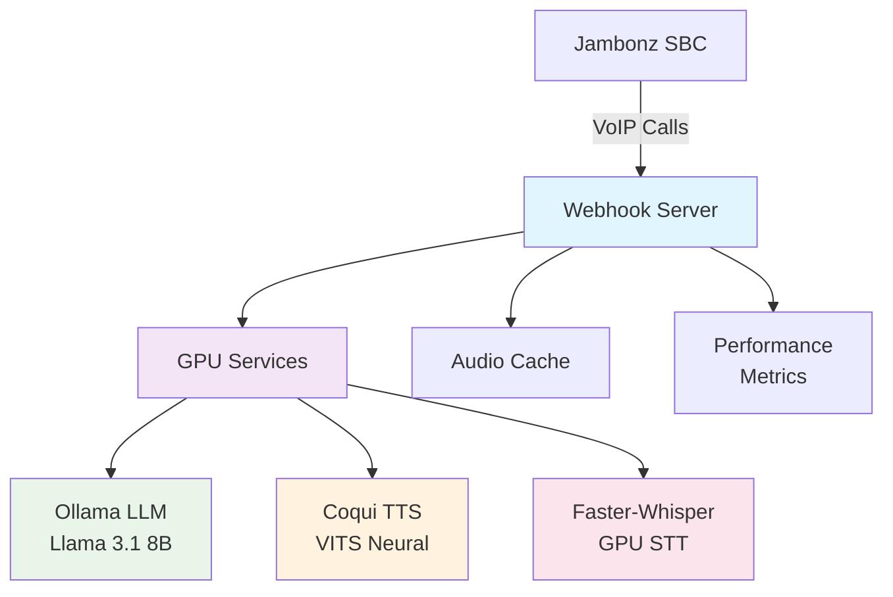
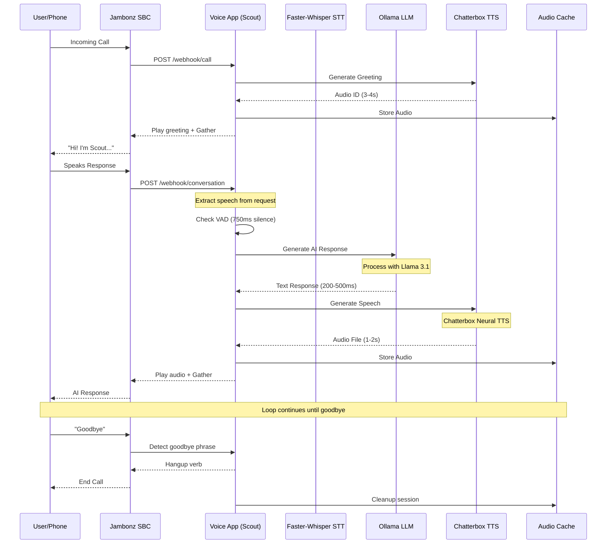

# OpenSourceVoice - 100% Local GPU Voice AI Stack

**Complete Docker Compose solution for AI-powered voice applications with Jambonz integration**

A containerized voice AI stack that runs entirely on local GPU hardware with no external API dependencies. Provides speech-to-text, text-to-speech, and conversational AI capabilities for telephony applications.

## 🌟 Features

- **🎤 GPU Speech Recognition** - Faster-Whisper (3x+ speedup over standard Whisper)
- **🧠 Local LLM Processing** - Ollama with Llama 3.1, Mistral, Phi-3, and more  
- **🎵 Production-Quality TTS** - Coqui VITS neural synthesis (67x real-time)
- **📊 Performance Monitoring** - Real-time metrics and GPU vs cloud comparisons
- **🔄 Automatic Cleanup** - Intelligent audio file management
- **🚀 Zero External APIs** - 100% self-hosted, no data leaves your infrastructure
- **🐳 Container-Ready** - Complete Docker Compose deployment
- **📞 Jambonz Compatible** - Drop-in webhook server for VoIP integration

## 🏗️ Architecture


```mermaid
graph TB
    A[Jambonz SBC] -->|VoIP Calls| B[Webhook Server]
    B --> C[GPU Services]
    
    C --> D[Ollama LLM<br/>Llama 3.1 8B]
    C --> E[Coqui TTS<br/>VITS Neural]
    C --> F[Faster-Whisper<br/>GPU STT]
    
    B --> G[Audio Cache]
    B --> H[Performance<br/>Metrics]
    
    style B fill:#e1f5fe
    style C fill:#f3e5f5
    style D fill:#e8f5e8
    style E fill:#fff3e0
    style F fill:#fce4ec
```

## ⚡ Performance Results

| Component | Processing Time | Quality | Hardware |
|-----------|----------------|---------|----------|
| **LLM (Llama 3.1 8B)** | 4.9 seconds | Human-like responses | RTX 3090 Ti |
| **TTS (VITS)** | 1.7 seconds | 22kHz professional | RTX 3090 Ti |
| **Total Response** | **6.6 seconds** | Production-ready | RTX 3090 Ti |

*67x faster than real-time for TTS generation*

## 📊 System Flow Sequence Diagram


```mermaid
sequenceDiagram
    participant User as User/Phone
    participant SBC as Jambonz SBC
    participant App as Voice App (Scout)
    participant STT as Faster-Whisper STT
    participant LLM as Ollama LLM
    participant TTS as Chatterbox TTS
    participant Cache as Audio Cache

    User->>SBC: Incoming Call
    SBC->>App: POST /webhook/call
    App->>TTS: Generate Greeting
    TTS-->>App: Audio ID (3-4s)
    App->>Cache: Store Audio
    App-->>SBC: Play greeting + Gather
    SBC-->>User: "Hi! I'm Scout..."
    
    User->>SBC: Speaks Response
    SBC->>App: POST /webhook/conversation
    Note over App: Extract speech from request
    App->>App: Check VAD (750ms silence)
    
    App->>LLM: Generate AI Response
    Note over LLM: Process with Llama 3.1
    LLM-->>App: Text Response (200-500ms)
    
    App->>TTS: Generate Speech
    Note over TTS: Chatterbox Neural TTS
    TTS-->>App: Audio File (1-2s)
    
    App->>Cache: Store Audio
    App-->>SBC: Play audio + Gather
    SBC-->>User: AI Response
    
    Note over User,Cache: Loop continues until goodbye
    
    User->>SBC: "Goodbye"
    SBC->>App: Detect goodbye phrase
    App-->>SBC: Hangup verb
    SBC-->>User: End Call
    App->>Cache: Cleanup session
```

## 🛠️ Command Reference Guide

### Core Management Commands

| Command | Purpose | When to Use |
|---------|---------|------------|
| `./setup.sh` | Initial setup and start all services | First time setup or full restart |
| `./run.sh` | Interactive management menu | Daily operations and troubleshooting |
| `docker-compose up -d` | Start all services in background | Production deployment |
| `docker-compose down` | Stop all services gracefully | Maintenance or shutdown |
| `docker-compose down -v` | Stop and remove all data | Complete reset needed |

### Development & Debugging Commands

| Command | Purpose | Example Output |
|---------|---------|----------------|
| `docker-compose logs -f voice-app` | Watch real-time logs | See live call processing |
| `docker-compose logs -f voice-app --tail=100` | View last 100 log lines | Debug recent issues |
| `docker-compose ps` | Check service status | Verify all containers running |
| `docker-compose restart voice-app` | Restart the voice application | Apply code changes |
| `docker-compose build --no-cache voice-app` | Rebuild app without cache | Force fresh build |

### Service-Specific Commands

#### 🧠 LLM Management (Ollama)
```bash
# Pull a new model
docker exec voice-ai-llm ollama pull llama3.1:8b

# List installed models
docker exec voice-ai-llm ollama list

# Test LLM directly
docker exec voice-ai-llm ollama run llama3.1:8b "Hello, how are you?"

# Monitor GPU usage during LLM
docker exec voice-ai-llm nvidia-smi
```

#### 🎵 TTS Management (Chatterbox/Coqui)
```bash
# Test TTS generation
curl -X POST http://localhost:5002/api/tts \
  -d "text=Hello world" \
  -o test.wav

# Check TTS service health
curl http://localhost:5002/health

# View TTS logs
docker-compose logs -f voice-ai-tts
```

#### 🎤 STT Management (Faster-Whisper)
```bash
# Check Whisper service
curl http://localhost:9000/health

# Monitor transcription performance
docker-compose logs -f voice-ai-whisper | grep "transcription"
```

### Monitoring & Performance Commands

| Command | Purpose | Key Metrics |
|---------|---------|-------------|
| `curl localhost:3003/metrics` | View performance metrics | Response times, success rates |
| `curl localhost:3003/health` | Check application health | Service status, active calls |
| `docker stats` | Monitor resource usage | CPU, Memory, Network I/O |
| `watch -n 1 nvidia-smi` | Monitor GPU usage | GPU memory, utilization |

### Troubleshooting Commands

#### 🔍 Debugging Connection Issues
```bash
# Check if services are listening
netstat -tulpn | grep -E "3003|5002|9000|11434"

# Test webhook endpoint
curl -X POST http://localhost:3003/webhook/call \
  -H "Content-Type: application/json" \
  -d '{"call_sid":"test-123","from":"1234567890","to":"0987654321"}'

# Check Docker network
docker network inspect opensourcevoice_voice-ai-network

# Verify service connectivity
docker exec voice-ai-webhook ping ollama
```

#### 🔧 Fix Common Issues
```bash
# Clear audio cache
docker exec voice-ai-webhook rm -rf /app/audio-cache/*

# Reset conversation state
docker-compose restart voice-app

# Force reconnect to services
docker-compose restart voice-ai-llm voice-ai-tts voice-ai-whisper

# Complete reset (WARNING: Loses all data)
docker-compose down -v && docker-compose up -d
```

### Advanced Operations

#### 📦 Backup & Restore
```bash
# Backup models and data
docker run --rm -v opensourcevoice_ollama-data:/data \
  -v $(pwd)/backup:/backup alpine \
  tar czf /backup/ollama-backup.tar.gz -C /data .

# Restore from backup
docker run --rm -v opensourcevoice_ollama-data:/data \
  -v $(pwd)/backup:/backup alpine \
  tar xzf /backup/ollama-backup.tar.gz -C /data
```

#### 🔄 Update Services
```bash
# Update voice app code
git pull
docker-compose build --no-cache voice-app
docker-compose up -d voice-app

# Update Ollama models
docker exec voice-ai-llm ollama pull llama3.1:latest

# Update all services
docker-compose pull
docker-compose up -d
```

#### 📈 Performance Tuning
```bash
# Adjust LLM temperature (in .env)
echo "LLM_TEMPERATURE=0.7" >> .env

# Change TTS provider
echo "TTS_PROVIDER=coqui" >> .env

# Increase timeouts for slow networks
echo "LLM_TIMEOUT_MS=30000" >> .env
echo "TTS_TIMEOUT_MS=40000" >> .env

# Apply changes
docker-compose up -d
```

### Testing Commands

#### 📞 Test Call Flow
```bash
# Simulate incoming call
npm run test:inbound

# Test outbound calling
npm run test:outbound -- --to +15087374849

# Load testing (10 concurrent calls)
npm run test:load -- --concurrent 10 --duration 60

# Test specific scenario
npm run test:scenario -- --scenario account-verification
```

#### 🎯 Test Individual Components
```bash
# Test only TTS
curl -X POST http://localhost:3003/test/tts \
  -H "Content-Type: application/json" \
  -d '{"text":"Testing text to speech"}'

# Test only LLM
curl -X POST http://localhost:3003/test/llm \
  -H "Content-Type: application/json" \
  -d '{"prompt":"What is the weather like?"}'

# Test VAD settings
curl -X POST http://localhost:3003/test/vad \
  -H "Content-Type: application/json" \
  -d '{"audio":"base64_encoded_audio"}'
```

### Production Commands

#### 🚀 Deployment
```bash
# Production start with logging
docker-compose up -d && docker-compose logs -f

# Health check loop
while true; do \
  curl -s http://localhost:3003/health | jq .; \
  sleep 30; \
done

# Auto-restart on failure
docker-compose up -d --restart unless-stopped
```

#### 📊 Monitoring
```bash
# Export metrics to Prometheus
curl http://localhost:3003/metrics | \
  curl -X POST http://prometheus:9091/metrics/job/voice-app --data-binary @-

# Generate daily report
docker-compose logs --since 24h voice-app | \
  grep "Call completed" | wc -l > daily-calls.txt
```

## 🔍 Understanding the Commands

### Docker Compose Lifecycle
1. **`up`** - Creates and starts containers
2. **`down`** - Stops and removes containers
3. **`restart`** - Stops and starts containers
4. **`build`** - Builds or rebuilds services
5. **`logs`** - Shows container logs
6. **`ps`** - Lists running containers
7. **`exec`** - Runs commands in containers

### Key Flags Explained
- **`-d`** - Detached mode (background)
- **`-f`** - Follow logs in real-time
- **`--tail`** - Number of lines to show
- **`--no-cache`** - Ignore build cache
- **`-v`** - Remove volumes when stopping
- **`--since`** - Show logs since timestamp

## 🚀 Quick Start

### Prerequisites

- **Hardware**: NVIDIA GPU with 8GB+ VRAM
- **Software**: Docker + NVIDIA Container Toolkit
- **OS**: Linux (Ubuntu 20.04+ recommended)

### 1. Install NVIDIA Container Toolkit

```bash
# Ubuntu/Debian
distribution=$(. /etc/os-release;echo $ID$VERSION_ID) \
   && curl -fsSL https://nvidia.github.io/libnvidia-container/gpgkey | sudo gpg --dearmor -o /usr/share/keyrings/nvidia-container-toolkit-keyring.gpg \
   && curl -s -L https://nvidia.github.io/libnvidia-container/$distribution/libnvidia-container.list | \
        sed 's#deb https://#deb [signed-by=/usr/share/keyrings/nvidia-container-toolkit-keyring.gpg] https://#g' | \
        sudo tee /etc/apt/sources.list.d/nvidia-container-toolkit.list

sudo apt-get update
sudo apt-get install -y nvidia-container-toolkit
sudo systemctl restart docker

# Verify GPU access
docker run --rm --gpus all nvidia/cuda:11.8-base-ubuntu20.04 nvidia-smi
```

### 2. Deploy the Voice AI Stack

```bash
# Start all GPU services
docker compose up -d

# Monitor startup - wait for all services to be healthy
docker compose logs -f

# Download LLM model (if not already downloaded)
docker exec voice-ai-llm ollama pull llama3.1:8b
```

### 3. Verify Installation

```bash
# Check all services are healthy
docker compose ps

# Test webhook server
curl http://localhost:3003/health

# Test initial call webhook
curl -X POST http://localhost:3003/webhook/call \
  -H "Content-Type: application/json" \
  -d '{"call_sid":"test","from":"+1234567890","to":"+1987654321"}'
```

## 📊 Service Endpoints

| Service | URL | Purpose | Status |
|---------|-----|---------|---------|
| **Webhook Server** | `http://localhost:3003` | Jambonz integration | Primary |
| **Ollama (LLM)** | `http://localhost:11435` | Language model inference | GPU Required |
| **Coqui TTS** | `http://localhost:5002` | Text-to-speech synthesis | GPU Required |
| **Faster-Whisper** | `http://localhost:9000` | Speech recognition | GPU Required |

### Key Webhook Endpoints
- **Call Handler**: `POST /webhook/call` - Handles incoming calls
- **Conversation**: `POST /webhook/conversation` - Processes speech input  
- **Status Updates**: `POST /webhook/status` - Call status notifications
- **Health Check**: `GET /health` - Service health monitoring
- **Audio Files**: `GET /audio/generated/:id` - Serves generated TTS audio

## 🔧 Configuration Options

### LLM Models (Ollama)

| Model | Size | Use Case | VRAM Required |
|-------|------|----------|---------------|
| `llama3.1:8b` | 4.7GB | **Recommended** - Best balance | 6GB+ |
| `phi3:mini` | 2.3GB | Fastest, simple tasks | 4GB+ |
| `mistral:7b` | 4.1GB | Efficient alternative | 6GB+ |
| `llama3.1:70b` | 40GB | Highest quality | 48GB+ |

```bash
# Switch models
docker exec voice-ai-llm ollama pull phi3:mini
# Update OLLAMA_MODEL=phi3:mini in .env and restart
```

### TTS Voices (VITS Speakers)

| Speaker ID | Gender | Age | Accent | Example |
|------------|--------|-----|--------|---------|
| `p225` | Female | Young | Southern England | **Default** |
| `p226` | Male | Young | Surrey | Professional |
| `p227` | Male | Young | Cumbria | Friendly |
| `p228` | Female | Young | Southern England | Clear |
| `p229` | Female | Young | Southern England | Warm |

```bash
# Change voice in .env
VITS_SPEAKER_ID=p226  # Male voice
# Restart: docker-compose restart voice-app
```

## 📞 Jambonz Integration

### Jambonz Application Configuration

Configure your Jambonz application to point to this webhook server:

```json
{
  "name": "Open Source Voice AI",
  "call_hook": {
    "url": "https://your-domain.com/webhook/call",
    "method": "POST"
  },
  "call_status_hook": {
    "url": "https://your-domain.com/webhook/status", 
    "method": "POST"
  }
}
```

**Important**: Replace `your-domain.com` with your actual domain or use ngrok for local testing.

### Call Flow
1. **Incoming Call** → `/webhook/call` generates AI greeting using GPU TTS
2. **User Speech** → Captured and sent to `/webhook/conversation` 
3. **AI Processing** → Speech → Ollama LLM → Coqui TTS → Audio response
4. **Audio Playback** → Generated audio file served via `verb: "play"`

### 🎯 Jambonz Action Verbs Reference

Jambonz Action Verbs are the fundamental building blocks that control call flow and interactions. Your webhook server returns JSON responses containing these verbs to instruct Jambonz on what actions to perform.

#### Core Media Verbs

| Verb | Purpose | When to Use | Example |
|------|---------|-------------|---------|
| **`play`** | Stream audio files (MP3/WAV) | Pre-recorded messages, generated TTS files | Greeting playback |
| **`say`** | Convert text to speech in real-time | Dynamic content, simple responses | Quick confirmations |
| **`gather`** | Collect user input (speech/DTMF) | Interactive menus, data collection | Phone number capture |
| **`pause`** | Insert silence/delay | Prevent audio clipping, natural pauses | Post-answer delay |

#### Key Differences: `play` vs `say`

**Use `play` for:**
- Generated TTS audio files (like our Chatterbox/Coqui output)
- Pre-recorded audio messages
- Complex audio that needs caching
- Production-quality voice synthesis

```json
{
  "verb": "play",
  "url": "https://your-domain.com/audio/generated/greeting-123.wav",
  "actionHook": "/after-greeting"
}
```

**Use `say` for:**
- Simple, dynamic text responses
- Quick confirmations or short messages
- When immediate response is more important than audio quality
- Testing and development

```json
{
  "verb": "say",
  "text": "Thank you. Please hold while I process your request.",
  "synthesizer": {
    "vendor": "default",
    "voice": "default"
  }
}
```

#### Input Collection Verbs

| Verb | Purpose | Input Types | Use Case |
|------|---------|-------------|----------|
| **`gather`** | Collect speech or DTMF | `["speech"]`, `["dtmf"]`, `["speech", "dtmf"]` | Menu navigation, data entry |
| **`dtmf`** | Collect only DTMF tones | Keypad only | PIN entry, menu selection |

**Gather Example (Our Voice AI Use Case):**
```json
{
  "verb": "gather",
  "actionHook": "/webhook/conversation",
  "input": ["speech"],
  "timeout": 15,
  "recognizer": {
    "vendor": "default",
    "language": "en-US"
  },
  "say": {
    "text": "How can I help you today?"
  }
}
```

**VAD (Voice Activity Detection) Settings:**
```json
{
  "verb": "gather",
  "input": ["speech"],
  "recognizer": {
    "vendor": "default", 
    "language": "en-US",
    "voiceMs": 750  // Wait 750ms of silence before processing
  }
}
```

#### Call Control Verbs

| Verb | Purpose | When to Use | Result |
|------|---------|-------------|---------|
| **`answer`** | Answer incoming call | Prevent audio clipping | Establishes media path |
| **`hangup`** | End the call | Conversation complete | Call termination |
| **`redirect`** | Transfer to different webhook | Change conversation flow | New application control |

**Answer + Pause Pattern (Recommended):**
```json
[
  {
    "verb": "answer"
  },
  {
    "verb": "pause",
    "length": 1.0
  },
  {
    "verb": "play",
    "url": "https://your-domain.com/audio/greeting.wav"
  }
]
```

#### Advanced Verbs

| Verb | Purpose | Use Case | Example |
|------|---------|----------|---------|
| **`config`** | Modify session settings | Change TTS voice, language | Voice switching |
| **`dial`** | Make outbound calls | Transfer, conference | Call forwarding |
| **`conference`** | Multi-party calls | Group conversations | Conference bridge |
| **`tag`** | Add metadata | Call tracking, analytics | Customer data |

**Config Example (Voice Switching):**
```json
{
  "verb": "config",
  "synthesizer": {
    "vendor": "coqui",
    "voice": "p226"  // Male voice
  }
}
```

#### Response Structure Patterns

**Single Action Response:**
```json
{
  "verb": "say",
  "text": "Hello, welcome to our service!"
}
```

**Sequential Actions (Array):**
```json
[
  {
    "verb": "pause",
    "length": 1.5
  },
  {
    "verb": "play", 
    "url": "/audio/greeting.wav"
  },
  {
    "verb": "gather",
    "actionHook": "/process-input",
    "input": ["speech"],
    "timeout": 10
  }
]
```

**Nested Actions (Gather with Prompt):**
```json
{
  "verb": "gather",
  "actionHook": "/collect-info",
  "input": ["speech", "dtmf"],
  "timeout": 15,
  "say": {
    "text": "Please say or press your account number"
  }
}
```

#### Error Handling & Timeouts

**Action Hook Delays (User Waiting):**
```json
{
  "verb": "gather",
  "actionHook": "/process-speech",
  "actionHookDelayAction": {
    "enabled": true,
    "noResponseTimeout": 2,
    "actions": [
      {
        "verb": "say",
        "text": "Please hold while I process that..."
      }
    ]
  }
}
```

**Timeout Handling:**
```json
{
  "verb": "gather",
  "input": ["speech"],
  "timeout": 10,
  "say": {
    "text": "I didn't hear anything. Please try again."
  },
  "actionHook": "/handle-timeout"
}
```

#### Our Voice AI Implementation

**Initial Call Response (voice-app.js):**
```javascript
// Generate greeting with Chatterbox TTS
const audioId = await generateChatterboxTTS(greetingText, callSid);
const audioUrl = `${process.env.WEBHOOK_BASE_URL}/audio/generated/${audioId}`;

return res.json([
  {
    verb: "play",
    url: audioUrl,
    actionHook: `${process.env.WEBHOOK_BASE_URL}/webhook/conversation`
  },
  {
    verb: "gather",
    actionHook: `${process.env.WEBHOOK_BASE_URL}/webhook/conversation`,
    input: ["speech"],
    timeout: 15,
    recognizer: {
      vendor: "default",
      language: "en-US",
      voiceMs: 750  // Standardized VAD setting
    }
  }
]);
```

**Conversation Response Pattern:**
```javascript
// After AI processing
return res.json([
  {
    verb: "play",
    url: generatedAudioUrl
  },
  {
    verb: "gather", 
    actionHook: `${process.env.WEBHOOK_BASE_URL}/webhook/conversation`,
    input: ["speech"],
    timeout: 15,
    recognizer: {
      vendor: "default",
      language: "en-US", 
      voiceMs: 750
    }
  }
]);
```

#### Common Patterns

**1. Greeting with Input Collection:**
```json
[
  {"verb": "answer"},
  {"verb": "pause", "length": 1},
  {
    "verb": "gather",
    "say": {"text": "Hi! I'm Scout. How can I help you today?"},
    "input": ["speech"],
    "actionHook": "/process-request"
  }
]
```

**2. Confirmation Pattern:**
```json
{
  "verb": "gather",
  "say": {"text": "I heard you say 555-1234. Is that correct? Say yes or no."},
  "input": ["speech"],
  "actionHook": "/confirm-number"
}
```

**3. Error Recovery:**
```json
{
  "verb": "gather", 
  "say": {"text": "I'm sorry, I didn't understand. Could you please repeat that?"},
  "input": ["speech"],
  "timeout": 10,
  "actionHook": "/retry-input"
}
```

**4. Call Termination:**
```json
[
  {
    "verb": "say",
    "text": "Thank you for calling. Have a great day!"
  },
  {
    "verb": "hangup"
  }
]
```

#### Best Practices

1. **Always use `play` for generated TTS files** - Better quality and caching
2. **Standardize VAD settings** - Use `voiceMs: 750` for phone number capture  
3. **Include actionHooks** - Handle completion and errors
4. **Use pauses after answer** - Prevent audio clipping (1-1.5 seconds)
5. **Set appropriate timeouts** - Balance user experience vs system load
6. **Handle empty responses** - Provide fallback messages
7. **Chain actions logically** - Each response should lead to next step

## 🔍 Monitoring & Debugging

### Health Checks

```bash
# Overall system health
curl http://localhost:3003/health | jq

# Performance metrics
curl http://localhost:3003/metrics | jq

# Individual service status
curl http://localhost:11434/api/tags        # Ollama models
curl http://localhost:5002/                 # Coqui TTS
curl http://localhost:9000/health           # Faster-Whisper
```

### Log Monitoring

```bash
# All services
docker-compose logs -f

# Specific services
docker-compose logs -f voice-app      # Main application
docker-compose logs -f ollama         # LLM processing
docker-compose logs -f coqui-tts      # Text-to-speech
docker-compose logs -f faster-whisper # Speech recognition
```

### Testing Webhooks

```bash
# Test incoming call
curl -X POST http://localhost:3003/webhook/call \\
  -H \"Content-Type: application/json\" \\
  -d '{
    \"call_sid\": \"test-call-123\",
    \"from\": \"+15551234567\",
    \"to\": \"+15559876543\"
  }'

# Test conversation 
curl -X POST http://localhost:3003/webhook/conversation \\
  -H \"Content-Type: application/json\" \\
  -d '{
    \"call_sid\": \"test-call-123\",
    \"speech\": {
      \"alternatives\": [{\"transcript\": \"Hello, how are you?\"}]
    }
  }'
```

## ⚙️ Advanced Configuration

### Environment Variables

| Variable | Default | Description |
|----------|---------|-------------|
| `OLLAMA_MODEL` | `llama3.1:8b` | LLM model to use |
| `VITS_SPEAKER_ID` | `p225` | TTS voice selection |
| `LLM_TEMPERATURE` | `0.7` | Response creativity (0.0-1.0) |
| `LLM_MAX_TOKENS` | `100` | Response length limit |
| `AUDIO_CACHE_HOURS` | `1` | Audio file retention |
| `MAX_CONVERSATION_HISTORY` | `10` | Memory limit per call |

### Performance Tuning

**For Lower-End GPUs (4-6GB VRAM):**
```bash
# Use smaller models
OLLAMA_MODEL=phi3:mini
# Reduce context length
LLM_MAX_TOKENS=50
```

**For High-End GPUs (24GB+ VRAM):**
```bash
# Use larger, higher-quality models
OLLAMA_MODEL=llama3.1:70b
# Increase context for better conversations
LLM_MAX_TOKENS=200
MAX_CONVERSATION_HISTORY=20
```

### Resource Management

```yaml
# docker-compose.yml resource limits
services:
  voice-app:
    deploy:
      resources:
        limits:
          memory: 2G
        reservations:
          memory: 1G
          
  ollama:
    deploy:
      resources:
        limits:
          memory: 10G
        reservations:
          memory: 6G
```

## 🚨 Troubleshooting

### Common Issues

**🔴 \"NVIDIA-SMI has failed\"**
```bash
# Verify NVIDIA drivers
nvidia-smi

# Install NVIDIA Container Toolkit
sudo apt install nvidia-container-toolkit
sudo systemctl restart docker
```

**🔴 \"Model not found\" (Ollama)**
```bash
# Download the model manually
docker exec voice-ai-llm ollama pull llama3.1:8b

# List available models
docker exec voice-ai-llm ollama list
```

**🔴 \"TTS API Error 500\"**
```bash
# Check Coqui TTS logs
docker-compose logs coqui-tts

# Verify speaker ID exists
curl \"http://localhost:5002/api/tts?text=test&speaker_id=p225\"
```

**🔴 \"Connection refused\" errors**
```bash
# Check service startup order
docker-compose ps

# Restart in correct order
docker-compose down
docker-compose up -d ollama coqui-tts faster-whisper
docker-compose up -d voice-app
```

### Performance Issues

**Slow Response Times:**
- Check GPU utilization: `nvidia-smi`
- Reduce model size: `OLLAMA_MODEL=phi3:mini`
- Lower token limit: `LLM_MAX_TOKENS=50`

**High Memory Usage:**
- Add memory limits to docker-compose.yml
- Reduce conversation history: `MAX_CONVERSATION_HISTORY=5`
- Use smaller models

**Audio Quality Issues:**
- Try different speakers: `VITS_SPEAKER_ID=p226`
- Check TTS model loading: `docker-compose logs coqui-tts`

## 📈 Scaling & Production

### Load Balancing

```yaml
# docker-compose.yml - Multiple webhook instances
services:
  voice-app-1:
    <<: *voice-app-template
    ports: [\"3003:3003\"]
    
  voice-app-2:  
    <<: *voice-app-template
    ports: [\"3004:3003\"]
    
  nginx:
    image: nginx:alpine
    ports: [\"80:80\"]
    # Configure load balancing
```

### Monitoring

```bash
# Prometheus metrics (add to docker-compose.yml)
services:
  prometheus:
    image: prom/prometheus
    ports: [\"9090:9090\"]
    
  grafana:
    image: grafana/grafana
    ports: [\"3000:3000\"]
```

### Security

- Use TLS certificates for webhook endpoints
- Implement webhook authentication tokens
- Run containers as non-root users (already configured)
- Use secrets management for API keys

## 🤝 Contributing

We welcome contributions! Please see:

- **Issues**: Report bugs and request features
- **Pull Requests**: Code improvements and new features  
- **Documentation**: Help improve setup guides
- **Models**: Test and recommend new AI models

## 📜 License

MIT License - see LICENSE file for details.

## 🙏 Acknowledgments

This project builds on amazing open-source work from:

- **[Ollama](https://ollama.ai/)** - Local LLM inference
- **[Coqui TTS](https://github.com/coqui-ai/TTS)** - Open-source text-to-speech
- **[Faster-Whisper](https://github.com/guillaumekln/faster-whisper)** - Optimized speech recognition
- **[Jambonz](https://jambonz.org/)** - Open-source CPaaS platform

---

⭐ **Star this repo** if you found it useful!

🐛 **Report issues** to help improve the project

💬 **Join discussions** about voice AI and self-hosting